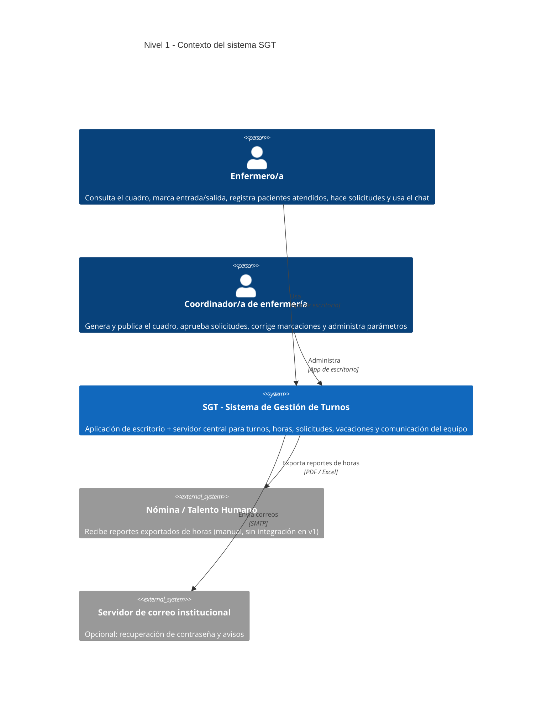
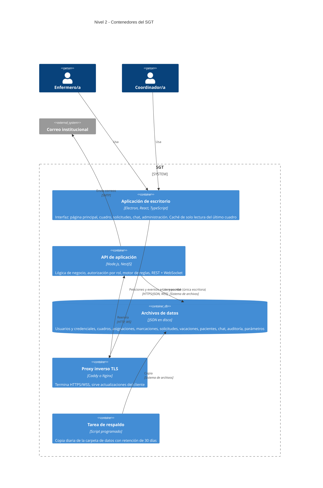
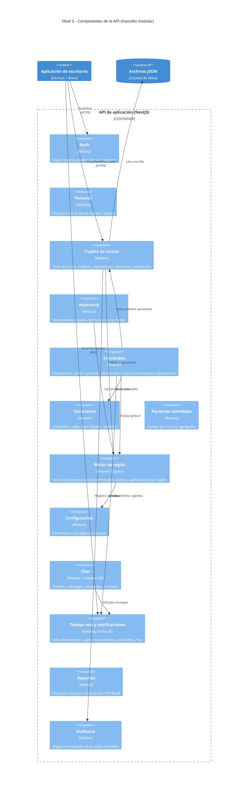
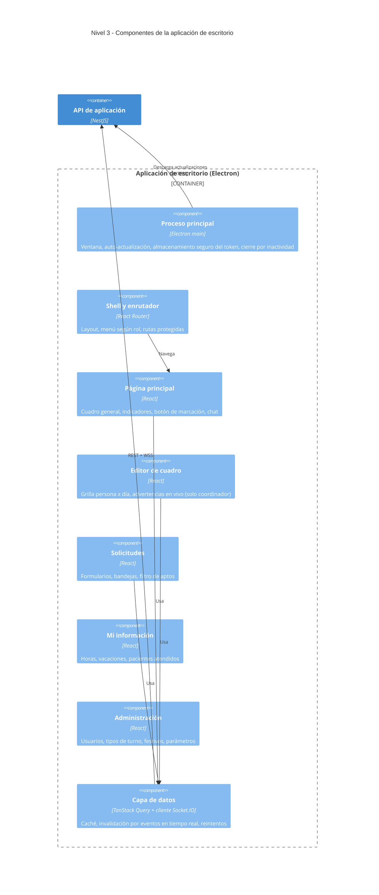
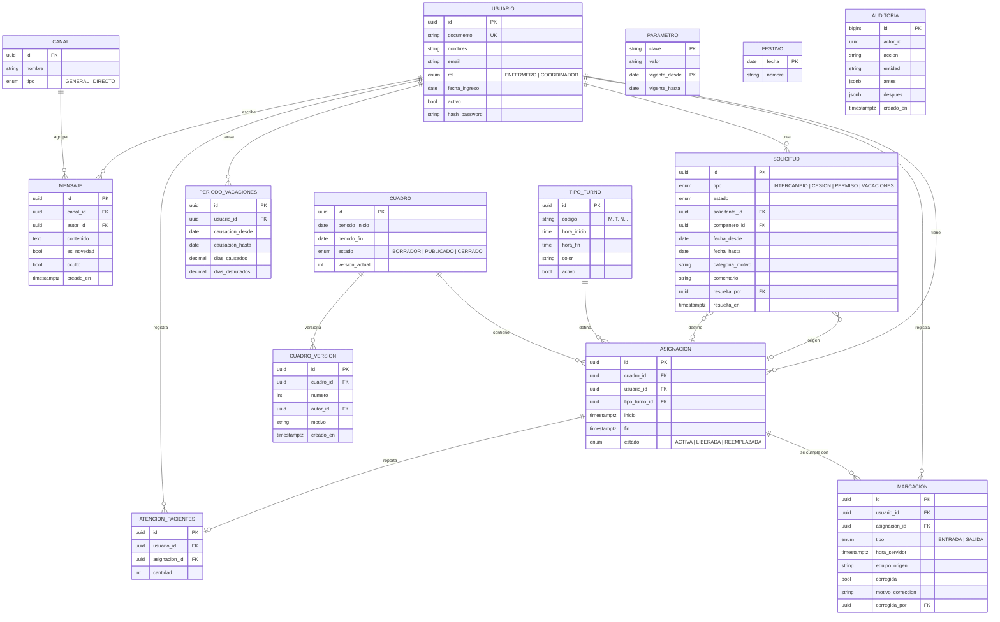
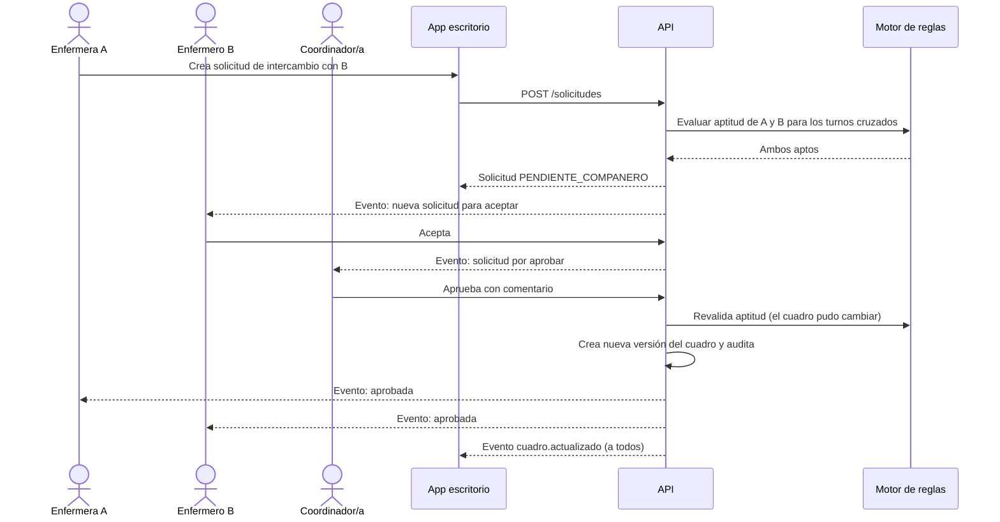
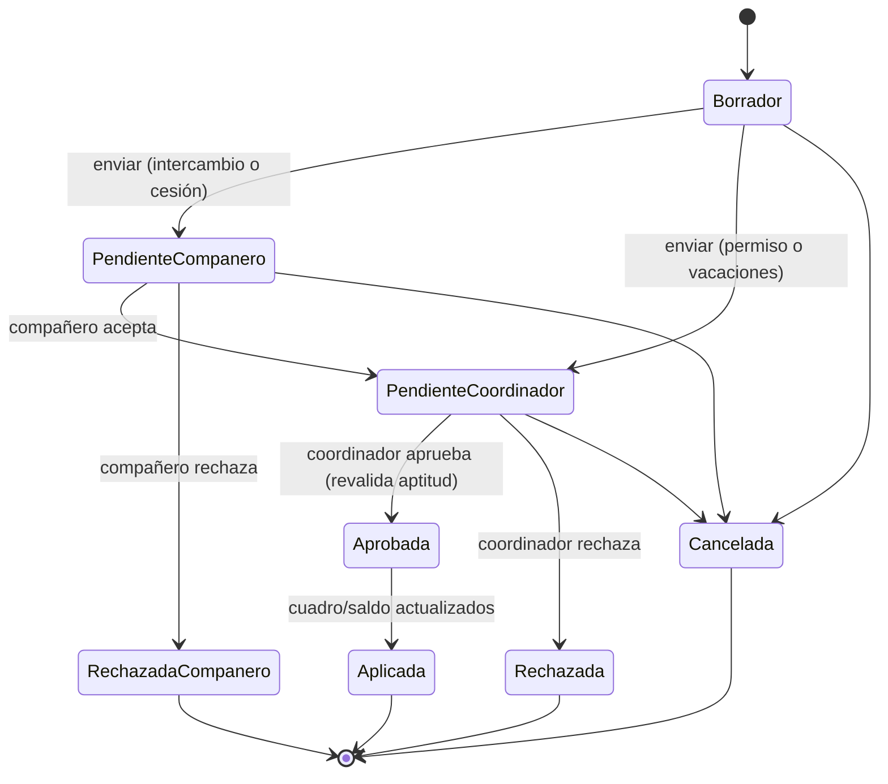

# SGT · Sistema de Gestión de Turnos de Enfermería
## Documento de planeación técnica para el equipo de desarrollo

| Campo | Valor |
|---|---|
| Versión | 0.3 (v0.2: respuestas del cliente, ver [02_Decisiones_Respuestas_Cliente.md](02_Decisiones_Respuestas_Cliente.md) · v0.3: **sin base de datos, persistencia en archivos JSON**, ADR-010) |
| Fecha | 24 de septiembre de 2026 |
| Fase | Planeación · levantamiento de requisitos y arquitectura (sin código) |
| Fecha de entrega comprometida | Miércoles 11 de noviembre de 2026 |
| Audiencia | Tech lead, desarrolladores, QA, product owner |

> **Decisión vigente (24-sep-2026): el proyecto NO usa base de datos.** Por tiempo, costo y complejidad, toda la información (credenciales incluidas) se guarda en **archivos JSON** administrados por la API. Ver ADR-010 y §9.5. Es una aplicación interna de un solo servicio (10 usuarios), no expuesta a internet.

> **Regla de esta fase:** no se escribe código de producto. Los entregables de la semana 0 son: requisitos validados, modelo C4, modelo de datos, decisiones de arquitectura (ADR), backlog priorizado y prototipos de pantalla (wireframes).

---

## 1. Contexto y objetivo

Un equipo de enfermería necesita reemplazar la gestión manual de su **cuadro de turnos** (hojas de cálculo, papel, mensajes sueltos) por una **aplicación de escritorio** compartida. La aplicación debe permitir que todo el personal vea el cuadro, marque su entrada y salida, solicite cambios, permisos y vacaciones, y se comunique por chat; y que un **coordinador/a** genere el cuadro y apruebe o rechace las solicitudes.

**Objetivo del MVP (11-nov-2026):** que el equipo pueda operar un mes completo de turnos dentro de la aplicación, con cálculo confiable de horas diurnas/nocturnas y un flujo de aprobación trazable.

## 2. Alcance

### 2.1 Priorización MoSCoW

| Prioridad | Funcionalidad |
|---|---|
| **Must** (MVP) | Login y roles · Gestión del personal · Cuadro de turnos (crear, publicar, vista general de solo lectura) · Marcación de entrada/salida con indicadores de estado · Cálculo de horas diurnas y nocturnas · Conteo de horas y disponibilidad · Solicitudes (cambio de turno, permiso, vacaciones) con aprobación del coordinador · Cálculo de saldo de vacaciones · Filtro de personal apto para cambios (sobrecarga) · Registro de pacientes atendidos · Chat general en la página principal |
| **Should** | Notificaciones dentro de la app · Exportar cuadro y reportes a PDF/Excel · Marcar mensajes del chat como "Novedad" · Consulta de auditoría para el coordinador · Copiar el cuadro del mes anterior como punto de partida |
| **Could** | Mensajes directos entre enfermeros · Publicar "turno disponible" desde el chat con botón de postulación · Recuperación de contraseña por correo · Tema oscuro |
| **Won't (v1)** | Generación automática/optimizada del cuadro · Liquidación completa de nómina (sí se calcula el valor estimado de recargos, ver ADR-008) · App móvil · Integración con biométricos, HIS o sistemas de talento humano · ~~Datos identificables de pacientes~~ (el cliente los pidió, ver ADR-009) · Modo sin conexión |

### 2.2 Supuestos (a confirmar en la reunión del 30-sep)

0. **Sin base de datos:** persistencia en archivos JSON en el equipo servidor (ADR-010). No se prevé crecer a más servicios ni exponer la app a internet.

1. Un solo servicio/unidad con un solo coordinador/a activo (el diseño admite varios servicios, pero la UI del MVP asume uno).
2. ~~Entre 15 y 60 usuarios~~ **Confirmado: 10 usuarios (1 coordinador y 9 enfermeros).** Todos usan equipos Windows 10/11 conectados a la red de la institución.
3. La institución opera en Colombia y la zona horaria es `America/Bogota` (UTC-5, sin horario de verano).
4. El personal se rige por el Código Sustantivo del Trabajo (sector privado). **Si es entidad pública, los parámetros laborales cambian** (ver RN-01) y deben confirmarse con talento humano.
5. ~~"Pacientes atendidos" es un conteo numérico por turno~~ **Cambia:** se registran nombre, documento, diagnóstico, teléfono y estado de egreso (ADR-009).
6. ~~La aplicación cuenta horas; no calcula dinero.~~ **Cambia:** calcula el valor estimado de recargos sobre horas reales (ADR-008); la liquidación oficial sigue siendo de nómina.

## 3. Actores y matriz de permisos

| Acción | Enfermero/a | Coordinador/a |
|---|:-:|:-:|
| Iniciar sesión, cambiar su contraseña | ✅ | ✅ |
| Ver el cuadro general de turnos | ✅ (solo lectura) | ✅ |
| Crear, editar y publicar el cuadro | ❌ | ✅ |
| Marcar su propia entrada/salida | ✅ | ✅ |
| Corregir marcaciones de otros (con motivo) | ❌ | ✅ |
| Ver indicadores de entrada/salida de todo el equipo | ✅ | ✅ |
| Ver sus propias horas, saldo de vacaciones y solicitudes | ✅ | ✅ |
| Ver horas y saldos de todo el equipo | ❌ | ✅ |
| Crear solicitudes (cambio, permiso, vacaciones) | ✅ | ✅ |
| Aceptar/rechazar un intercambio propuesto por un compañero | ✅ | ✅ |
| Aprobar/rechazar solicitudes | ❌ | ✅ |
| Consultar el filtro de aptos para un turno | ✅ (resultado apto/no apto, sin detalle de horas ajenas) | ✅ (con detalle) |
| Registrar pacientes atendidos en su turno | ✅ | ✅ |
| Usar el chat general | ✅ | ✅ |
| Administrar usuarios, tipos de turno, festivos y parámetros | ❌ | ✅ |

**Decidido:** las solicitudes del propio coordinador se autoaprueban y quedan como constancia (RF-SOL-08). **Pendiente:** quién lo reemplaza en ausencias.

## 4. Requisitos funcionales

Formato: `RF-<módulo>-<n>` · Prioridad M/S/C.

### 4.1 Autenticación y usuarios (AUT)
| ID | Requisito | P |
|---|---|:-:|
| RF-AUT-01 | Inicio de sesión con usuario (documento o correo) y contraseña. | M |
| RF-AUT-02 | Dos roles: `ENFERMERO` y `COORDINADOR`. Los permisos se validan en el servidor, no solo en la interfaz. | M |
| RF-AUT-03 | El coordinador crea, edita y desactiva usuarios (nunca los borra: se conserva el historial). | M |
| RF-AUT-04 | Contraseña temporal en el primer ingreso con cambio obligatorio. | M |
| RF-AUT-05 | Cierre de sesión automático por inactividad (equipos compartidos en estación de enfermería). | M |
| RF-AUT-06 | Transferencia del rol de coordinador a otro usuario, con registro de auditoría. | S |

### 4.2 Página principal (MAIN)
| ID | Requisito | P |
|---|---|:-:|
| RF-MAIN-01 | Vista general del cuadro del período vigente (mes/semana), visible para todos, solo lectura para enfermeros. | M |
| RF-MAIN-02 | Panel de indicadores de estado del turno actual por persona: Programado, En turno, Retrasado, Ausente, Salida pendiente, Finalizado. | M |
| RF-MAIN-03 | Panel de chat general integrado en la misma pantalla. | M |
| RF-MAIN-04 | Botón visible "Marcar entrada / Marcar salida" para el usuario en sesión. | M |
| RF-MAIN-05 | Actualización en tiempo real (sin recargar) cuando cambia el cuadro, una marcación o llega un mensaje. | M |
| RF-MAIN-06 | Resumen personal: próximas 3 asignaciones, horas del mes, saldo de vacaciones, solicitudes pendientes. | S |

### 4.3 Cuadro de turnos (CUA)
| ID | Requisito | P |
|---|---|:-:|
| RF-CUA-01 | Catálogo de tipos de turno configurable (código, nombre, hora inicio, hora fin, color). Ej.: M 07–13, T 13–19, N 19–07. | M |
| RF-CUA-02 | El coordinador crea un cuadro por período en estado **Borrador**, asignando tipos de turno por persona y día en una grilla. | M |
| RF-CUA-03 | Durante la edición, cada celda muestra advertencias de reglas (solapamiento, descanso insuficiente, exceso de horas, vacaciones/permiso aprobado). Las advertencias no bloquean; el coordinador decide. | M |
| RF-CUA-04 | Publicar el cuadro: pasa a **Publicado**, se notifica a todos y queda visible en la página principal. | M |
| RF-CUA-05 | Todo cambio sobre un cuadro publicado genera una nueva versión con autor, fecha y motivo (historial consultable). | M |
| RF-CUA-06 | Cierre del período: estado **Cerrado**; congela horas calculadas para reportes. | S |
| RF-CUA-07 | Copiar el cuadro del período anterior como borrador. | S |
| RF-CUA-08 | Exportar cuadro a PDF y Excel. | S |

### 4.4 Asistencia: entrada y salida (ASI)
| ID | Requisito | P |
|---|---|:-:|
| RF-ASI-01 | Marcación de entrada y salida por el propio usuario; la hora registrada es **la del servidor**, nunca la del equipo cliente. | M |
| RF-ASI-02 | La marcación se asocia a la asignación programada más cercana (ventana configurable, ej. ±2 h). Si no hay asignación, queda como "marcación sin turno" para revisión. | M |
| RF-ASI-03 | Cálculo automático del estado (RF-MAIN-02) según tolerancia de retraso configurable (ej. 10 min). | M |
| RF-ASI-04 | El coordinador puede crear o corregir marcaciones con motivo obligatorio; queda auditado (valor anterior y nuevo). | M |
| RF-ASI-05 | Alerta de "salida pendiente" cuando pasan X minutos del fin del turno sin marcación de salida. | S |
| RF-ASI-06 | Registro del equipo/IP desde el que se marcó (para control). | S |

### 4.5 Horas trabajadas y disponibilidad (HOR)
| ID | Requisito | P |
|---|---|:-:|
| RF-HOR-01 | Cálculo de horas **diurnas** y **nocturnas** por asignación, segmentando el intervalo según RN-01. | M |
| RF-HOR-02 | Clasificación adicional de horas en domingo/festivo (diurnas y nocturnas) usando el calendario de festivos. | M |
| RF-HOR-03 | Dos fuentes: horas **programadas** (cuadro) y horas **reales** (marcaciones). Se muestran ambas y la diferencia. | M |
| RF-HOR-04 | Acumulados por persona: día, semana, mes y período personalizado; horas por encima de la jornada máxima semanal marcadas como "exceso". | M |
| RF-HOR-05 | Vista de disponibilidad: por persona y fecha, franjas libres, ocupadas, en vacaciones o en permiso. | M |
| RF-HOR-06 | Reporte exportable de horas por período para nómina. | S |

### 4.6 Vacaciones (VAC)
| ID | Requisito | P |
|---|---|:-:|
| RF-VAC-01 | Cálculo de días causados según fecha de ingreso (RN-04), días disfrutados, días aprobados por disfrutar y saldo disponible. | M |
| RF-VAC-02 | Indicar **desde cuándo** la persona puede solicitar vacaciones (fecha de cumplimiento del período de causación) y con cuánta anticipación mínima. | M |
| RF-VAC-03 | Al solicitar, el sistema calcula los días hábiles del rango elegido (excluyendo no hábiles según parámetro) y la fecha de reintegro. | M |
| RF-VAC-04 | Al aprobar, el sistema libera las asignaciones del cuadro en ese rango y las marca como "requiere cobertura". | M |
| RF-VAC-05 | Historial de vacaciones por persona (solicitadas, aprobadas, rechazadas, disfrutadas). | M |
| RF-VAC-06 | Carga inicial de saldos históricos por el coordinador (migración desde el método actual). | M |

### 4.7 Solicitudes (SOL)
| ID | Requisito | P |
|---|---|:-:|
| RF-SOL-01 | Tipos de solicitud: **Intercambio de turno** (con un compañero), **Cesión de turno** (otro lo toma), **Permiso** (por horas o días) y **Vacaciones**. | M |
| RF-SOL-02 | En intercambio/cesión, el compañero destino debe aceptar antes de que llegue al coordinador. | M |
| RF-SOL-03 | Antes de enviar, el sistema valida la aptitud del compañero (RN-03) y muestra el resultado. | M |
| RF-SOL-04 | El coordinador aprueba o rechaza con comentario. Al aprobar, el cuadro se actualiza automáticamente (nueva versión) y se notifica a los involucrados. | M |
| RF-SOL-05 | El solicitante puede cancelar mientras no esté aprobada. | M |
| RF-SOL-06 | Bandeja del coordinador con filtros por tipo, estado y fecha; bandeja personal para cada enfermero. | M |
| RF-SOL-07 | El motivo de un permiso se captura como categoría (ej. personal, calamidad, cita médica, académico) más texto opcional; **no se solicitan diagnósticos**. | M |

### 4.8 Filtro de aptos para cambio de turno (APT)
| ID | Requisito | P |
|---|---|:-:|
| RF-APT-01 | Dado un turno (fecha + tipo), listar al personal clasificado en **Apto**, **Apto con advertencia** y **No apto**, con el motivo de cada clasificación. | M |
| RF-APT-02 | Orden sugerido: menor carga acumulada primero. | M |
| RF-APT-03 | Disponible para el coordinador (con detalle de horas) y para enfermeros al armar una solicitud (solo la clasificación y el motivo genérico). | M |

### 4.9 Pacientes atendidos (PAC)
| ID | Requisito | P |
|---|---|:-:|
| RF-PAC-01 | Registro del número de pacientes atendidos por turno, por el propio enfermero al cerrar el turno (o por el coordinador). | M |
| RF-PAC-02 | Totales y promedios por persona y período; visibles para el coordinador y para cada quien sobre sí mismo. | M |
| RF-PAC-03 | Uso opcional como indicador informativo de carga en el filtro de aptos (no determinante en el MVP). | C |

### 4.10 Chat y novedades (CHAT)
| ID | Requisito | P |
|---|---|:-:|
| RF-CHAT-01 | Canal general en tiempo real para todo el personal, con historial persistente y paginado. | M |
| RF-CHAT-02 | Indicador de mensajes no leídos. | M |
| RF-CHAT-03 | Marcar un mensaje como **Novedad** (se resalta y se puede filtrar). | S |
| RF-CHAT-04 | El autor puede editar/eliminar su mensaje en los primeros N minutos; el coordinador puede ocultar mensajes (queda auditado). | S |
| RF-CHAT-05 | Mensaje de sistema automático cuando un turno queda "requiere cobertura". | S |
| RF-CHAT-06 | Mensajes directos. | C |

### 4.11 Administración y configuración (ADM)
| ID | Requisito | P |
|---|---|:-:|
| RF-ADM-01 | Parámetros laborales con **vigencia desde/hasta** (RN-01, RN-02). | M |
| RF-ADM-02 | Calendario de festivos editable, precargado con los festivos de Colombia 2026–2027. | M |
| RF-ADM-03 | Registro de auditoría de acciones sensibles (login, cambios de cuadro, aprobaciones, correcciones de marcación, cambios de parámetros). | M |

## 5. Reglas de negocio

### RN-01 · Franjas diurna y nocturna
- Valores por defecto (sector privado, Colombia): **diurno 06:00–19:00, nocturno 19:00–06:00**. La jornada nocturna empieza a las 19:00 desde el 25-dic-2025 por el artículo 10 de la Ley 2466 de 2025 (antes empezaba a las 21:00).
- Si la institución es **pública**, el régimen puede ser distinto (históricamente 18:00–06:00 para empleados públicos). **Validar con talento humano antes del Sprint 3.**
- Los parámetros se guardan con fecha de vigencia: el cálculo usa el valor vigente **en la fecha trabajada**, no el de hoy.

**Algoritmo (descripción, no código):**
1. Tomar el intervalo `[inicio, fin)` de la asignación (programada) o del par de marcaciones (real), en hora local.
2. Partirlo en los cortes de 06:00, 19:00 (según parámetro) y 00:00.
3. Cada segmento se etiqueta con: franja (diurna/nocturna) y tipo de día (ordinario/dominical-festivo), según la fecha a la que pertenece ese segmento.
4. Sumar minutos por etiqueta; redondear solo al presentar.

**Casos de prueba obligatorios:**

| Turno | Diurnas | Nocturnas | Observación |
|---|--:|--:|---|
| Martes 07:00–13:00 | 6 | 0 | — |
| Martes 13:00–21:00 | 6 | 2 | Cruza 19:00 |
| Martes 19:00–miércoles 07:00 | 1 | 11 | Cruza medianoche |
| Sábado 19:00–domingo 07:00 | 1 (dominical) | 5 (ordinarias) + 6 (dominicales) | Cambia el tipo de día a las 00:00 |
| Turno que cruza del 24 al 25-dic-2025 | según vigencia | según vigencia | Cambio de parámetro a mitad de turno |

### RN-02 · Jornada máxima y exceso
- Jornada máxima semanal por defecto: **42 h**, vigente desde el 15-jul-2026 (Ley 2101 de 2021 / Ley 2466 de 2025). Parametrizable.
- Semana de cálculo: lunes 00:00 a domingo 23:59 (parametrizable).
- Horas por encima de la jornada máxima se marcan como "exceso" (posibles horas extra). La app no las liquida.

### RN-03 · Aptitud para tomar un turno (filtro de sobrecarga)
Una persona es **No apta** para un turno si se cumple cualquiera de:
1. Tiene otra asignación que se solapa.
2. Está en vacaciones, permiso aprobado o inactiva en esa fecha.
3. El descanso entre el fin de su turno anterior y el inicio del nuevo (o entre el fin del nuevo y su siguiente turno) es menor al **descanso mínimo** (parámetro; valor propuesto a validar: 12 h).
4. Sus horas programadas en la semana + la duración del turno superan **jornada máxima + tope de exceso permitido** (parámetros).
5. Supera el máximo de **noches consecutivas** (parámetro; propuesto: 3).

Es **Apta con advertencia** si queda por encima del umbral de alerta (propuesto: 90 % del límite semanal) o si el turno generaría exceso dentro del tope. En otro caso, **Apta**. Cada resultado incluye la lista de reglas evaluadas y cuál falló.

### RN-04 · Vacaciones
- Por defecto: **15 días hábiles consecutivos por cada año de servicio** (CST art. 186), causación proporcional visible.
- Se pueden solicitar a partir de cumplir el año de servicio (o antes, si la política interna permite anticipadas: parámetro).
- Anticipación mínima de la solicitud: parámetro (propuesto 15 días).
- Qué cuenta como "día hábil" para personal por turnos (¿sábado?, ¿días de descanso programado?) es **decisión del cliente** y es parámetro.
- Acumulación máxima y fraccionamiento: parámetros, a validar con talento humano.

### RN-05 · Ciclo de vida de una solicitud
Ver diagrama de estados en §9.3. Una solicitud aprobada nunca se edita: si hay que revertir, se crea una nueva solicitud o un ajuste del coordinador, ambos auditados.

### RN-06 · Versionado del cuadro
Un cuadro publicado no se sobrescribe: cada cambio crea una versión. Las horas calculadas de un período **Cerrado** se congelan (snapshot) aunque cambien los parámetros después.

## 6. Requisitos no funcionales

| ID | Categoría | Requisito |
|---|---|---|
| RNF-01 | Plataforma | Cliente de escritorio instalable en Windows 10/11 (x64). macOS/Linux posibles por el stack, no probados en el MVP. |
| RNF-02 | Rendimiento | Página principal cargada en < 2 s en red local; mensajes de chat y cambios de estado reflejados en < 1 s. |
| RNF-03 | Concurrencia | Soportar 20 usuarios conectados simultáneamente sin degradación (10 usuarios reales × 2 de margen). |
| RNF-04 | Seguridad | Contraseñas con Argon2id; tokens de acceso de corta duración con refresh; TLS en todas las comunicaciones, también en red local; autorización por rol en cada endpoint. |
| RNF-05 | Privacidad | Cumplimiento de la Ley 1581 de 2012 (habeas data): minimización de datos del personal, aviso de privacidad en el primer ingreso, cero datos identificables de pacientes. |
| RNF-06 | Trazabilidad | Auditoría inmutable de acciones sensibles, retenida mínimo 2 años (a confirmar). |
| RNF-07 | Disponibilidad | Servicio disponible 24/7 (los turnos son 24/7). Si el servidor cae, el cliente muestra el último cuadro descargado en solo lectura y un aviso claro. |
| RNF-08 | Respaldo | Copia automática diaria de la carpeta de datos JSON con retención de 30 días y prueba de restauración antes de la entrega. |
| RNF-09 | Usabilidad | Operable por personal no técnico con máximo 1 h de capacitación; textos 100 % en español; contraste accesible. |
| RNF-10 | Actualización | Actualización automática del cliente desde el servidor de la institución. |
| RNF-11 | Mantenibilidad | Cobertura de pruebas ≥ 90 % en el motor de cálculo de horas y reglas de aptitud; ≥ 60 % global en backend. |
| RNF-12 | Tiempo | Todas las fechas se almacenan en UTC y se presentan en `America/Bogota`. |

## 7. Historias de usuario clave (criterios de aceptación)

**HU-01 · Marcar entrada**
```gherkin
Dado que tengo un turno programado hoy de 07:00 a 13:00
Y son las 07:04 según el servidor
Cuando presiono "Marcar entrada"
Entonces se registra mi entrada a las 07:04
Y mi indicador cambia a "En turno" para todo el equipo
Y si la tolerancia es 10 min no aparezco como "Retrasado"
```

**HU-02 · Solicitar intercambio de turno**
```gherkin
Dado que tengo el turno N del 15-oct y mi compañera tiene el turno T del 16-oct
Cuando creo una solicitud de intercambio con ella
Entonces el sistema evalúa la aptitud de ambas para el turno ajeno
Y si alguna es "No apta" veo el motivo y no puedo enviar
Y si ambas son aptas, la solicitud queda "Pendiente de compañero"
```

**HU-03 · Aprobar solicitud (coordinador)**
```gherkin
Dado una solicitud de intercambio aceptada por el compañero
Cuando el coordinador la aprueba
Entonces el cuadro publicado crea una nueva versión con el intercambio
Y ambos reciben notificación
Y la página principal de todos se actualiza sin recargar
```

**HU-04 · Consultar aptos**
```gherkin
Dado un turno N del 20-oct sin cobertura
Cuando el coordinador consulta el filtro de aptos
Entonces ve tres grupos: Apto, Apto con advertencia, No apto
Y cada persona muestra el motivo (ej. "descanso de 8 h < 12 h mínimo")
Y los aptos aparecen ordenados de menor a mayor carga semanal
```

**HU-05 · Solicitar vacaciones**
```gherkin
Dado que cumplí un año de servicio y tengo 15 días de saldo
Cuando selecciono un rango de fechas
Entonces el sistema muestra cuántos días hábiles consume y mi fecha de reintegro
Y si la anticipación es menor a la mínima, no puedo enviar la solicitud
```

**HU-06 · Cálculo de horas nocturnas**
```gherkin
Dado un turno del sábado 19:00 al domingo 07:00
Cuando consulto mis horas
Entonces veo 5 h nocturnas ordinarias, 6 h nocturnas dominicales y 1 h diurna dominical
```

**HU-07 · Chat de novedades**
```gherkin
Dado que estoy en la página principal
Cuando escribo un mensaje en el chat general y lo marco como "Novedad"
Entonces todos lo reciben en menos de 1 s, resaltado como novedad
```

**HU-08 · Crear y publicar cuadro**
```gherkin
Dado un cuadro de noviembre en borrador
Cuando asigno a una persona dos turnos con 6 h de descanso entre ellos
Entonces la celda muestra advertencia de descanso insuficiente
Y al publicar el cuadro todo el equipo recibe la notificación
```

## 8. Arquitectura

### 8.1 Estilo arquitectónico
**Cliente-servidor con backend monolítico modular y persistencia en archivos JSON.** Varias estaciones de trabajo deben compartir el mismo cuadro, las mismas solicitudes y el mismo chat en tiempo real, así que cada app de escritorio no puede guardar sus propios datos: se necesita un proceso central (la API) que sea el **único** que lee y escribe los archivos JSON. Un monolito modular (un solo despliegue, módulos con límites claros) es lo adecuado para un equipo pequeño y un plazo de 7 semanas; los módulos quedan listos para separarse si algún día hace falta.

### 8.2 Registro de decisiones de arquitectura (ADR)

| ADR | Decisión | Alternativas | Razón | Estado |
|---|---|---|---|---|
| ADR-001 | Backend monolítico modular + API REST + WebSocket | Microservicios; app 100 % local | Plazo, tamaño del equipo, necesidad de datos compartidos | Propuesta |
| ADR-002 | Cliente **Electron + React + TypeScript**; API **Node.js + NestJS**; **Socket.IO** para tiempo real; persistencia en JSON (ADR-010); monorepo con tipos compartidos | Tauri (más liviano, requiere Rust); .NET (WPF/Avalonia + ASP.NET Core + SignalR) | Un solo lenguaje de punta a punta, ecosistema maduro, instalador y auto-update resueltos (electron-builder). **Si el equipo domina C#, la opción .NET es equivalente**; se decide el 25-sep según perfiles | Por decidir |
| ADR-003 | ~~**PostgreSQL** como base de datos única~~ | SQL Server; MongoDB; servicio de chat externo | — | **Reemplazada por ADR-010** (24-sep-2026) |
| ADR-004 | **Motor de reglas laborales parametrizable con vigencias** | Constantes en código | Las normas cambian por fechas (42 h desde jul-2026; recargo dominical 100 % desde jul-2027) y pueden variar entre sector público y privado | Propuesta |
| ADR-005 | **Hora del servidor** para marcaciones | Hora del cliente | Evita manipulación del reloj del equipo | Aceptada |
| ADR-006 | Horas calculadas = **dato derivado y recalculable**; snapshot solo al cerrar período | Guardar horas editables | Una sola fuente de verdad (asignaciones y marcaciones) | Propuesta |
| ADR-007 | Despliegue de la API (proceso Node.js) en **un equipo de la institución** que haga de servidor dentro de la red local; los archivos JSON viven en ese equipo | Nube (VPS); Docker Compose con base de datos | Datos dentro de la red, sin costos de infraestructura; depende de que el cliente defina qué equipo queda encendido 24/7 | Por decidir con el cliente |
| ADR-008 | **Valor estimado de recargos** con porcentajes base parametrizados con vigencia | No calcular dinero | El cliente envió salarios y tabla de recargos | Propuesta, validar 30-sep |
| ADR-009 | **Registro de pacientes con datos sensibles** cifrados por campo dentro del JSON y auditoría de lectura | Solo conteo | El cliente pidió nombre, documento, diagnóstico, teléfono y egreso | Propuesta, requiere aprobación escrita |
| ADR-010 | **Sin base de datos: persistencia en archivos JSON** administrados solo por la API (un archivo por colección; auditoría en JSON Lines). Credenciales en `usuarios.json` con contraseña hasheada (Argon2id) | PostgreSQL (ADR-003); SQLite; archivos JSON en carpeta compartida de red | Tiempo, costo y complejidad; 10 usuarios y un solo servicio; no se publica en internet. Se descarta la carpeta compartida porque varias estaciones escribiendo el mismo archivo lo corrompen | **Aceptada** (24-sep-2026) |

### 8.3 Estructura del monorepo (propuesta)
```
sgt/
├── apps/
│   ├── desktop/        # Electron + React (renderer) 
│   └── api/            # NestJS
├── packages/
│   ├── shared-types/   # DTOs y enums compartidos
│   └── rules-engine/   # cálculo de horas, aptitud, vacaciones (TS puro, sin dependencias de framework)
├── infra/              # scripts de respaldo de la carpeta de datos
└── docs/               # este documento, ADRs, diagramas
```
**Carpeta de datos** (fuera del repositorio, ruta configurable con `SGT_DATA_DIR`; en desarrollo `apps/api/datos/`, ignorada por git):
```
datos/
├── usuarios.json          # credenciales (hash Argon2id), rol, cargo, fecha de ingreso, historial salarial
├── tipos-turno.json
├── cuadros.json           # cuadros con sus versiones y asignaciones
├── marcaciones.json
├── solicitudes.json
├── vacaciones.json        # periodos causados y carga inicial
├── pacientes.json         # documento, teléfono y diagnóstico cifrados (AES-256-GCM)
├── chat/2026-10.json      # un archivo por mes para que no crezca sin límite
├── parametros.json        # parámetros laborales con vigencia
├── festivos.json
└── auditoria.jsonl        # JSON Lines: una línea por evento, solo se agrega al final
```

**Reglas de la persistencia JSON (ADR-010):**
1. **Solo la API escribe.** Las apps de escritorio nunca abren los archivos; todo pasa por la API.
2. **Escritura atómica:** se escribe en `archivo.json.tmp` y luego se renombra, para que un corte de luz no deje un archivo a medias.
3. **Escrituras en cola:** una sola escritura a la vez por archivo (cola en memoria), para evitar que dos peticiones se pisen.
4. **Caché en memoria:** los archivos se cargan al arrancar la API y se sirven desde memoria; con 10 usuarios el volumen es pequeño.
5. **Repositorios con interfaz:** cada módulo accede a sus datos a través de un repositorio (`UsuariosRepositorio`, etc.). Si algún día se necesita una base de datos, solo se cambia la implementación del repositorio.
6. **La llave de cifrado** de los datos de pacientes no se guarda en la carpeta de datos (variable de entorno del servidor).

`rules-engine` es un paquete puro y sin E/S para poder probarlo exhaustivamente de forma aislada; tanto la API como el cliente (para previsualizar advertencias) lo usan.

## 9. Modelo C4

> Los diagramas están en Mermaid; se renderizan en GitHub, GitLab, VS Code (extensión Mermaid), Notion y Obsidian.

### 9.1 Nivel 1 · Contexto del sistema



### 9.2 Nivel 2 · Contenedores



### 9.3 Nivel 3 · Componentes de la API



### 9.4 Nivel 3 · Componentes del cliente de escritorio



### 9.5 Nivel 4 · Modelo de datos (reemplaza el diagrama de código en esta fase)

> Es el **modelo lógico**. No hay base de datos: cada entidad se guarda como un arreglo de objetos en su archivo JSON (ver §8.3). Los `uuid` se generan en la API con `crypto.randomUUID()`, las fechas-hora van como texto ISO 8601 en UTC y las relaciones (`FK`) son simplemente el `id` del otro objeto.



### 9.6 Flujo: intercambio de turno



### 9.7 Estados de una solicitud



## 10. Contrato de API (vista de recursos, a detallar en OpenAPI durante el Sprint 0)

| Recurso | Operaciones | Rol |
|---|---|---|
| `/auth` | login, refresh, logout, cambiar contraseña | Todos |
| `/usuarios` | listar, crear, editar, desactivar, transferir coordinación | Coord. (listar básico: todos) |
| `/tipos-turno` | CRUD | Coord. |
| `/cuadros` | listar, crear, obtener vigente, publicar, cerrar, versiones, copiar | Lectura: todos · Escritura: coord. |
| `/cuadros/{id}/asignaciones` | listar, crear, mover, liberar | Coord. |
| `/marcaciones` | marcar (propia), listar, corregir | Marcar: todos · Corregir: coord. |
| `/horas` | resumen por usuario y período (programadas vs reales) | Propias: todos · Todas: coord. |
| `/disponibilidad` | franjas por usuario y rango | Todos |
| `/aptitud` | clasificar personal para un turno dado | Todos (detalle según rol) |
| `/solicitudes` | crear, listar, aceptar/rechazar (compañero), aprobar/rechazar (coord.), cancelar | Según estado y rol |
| `/vacaciones` | saldo, historial, simular rango, carga inicial | Propias: todos · Todas y carga: coord. |
| `/atenciones` | registrar, agregados | Todos / coord. |
| `/chat/canales/{id}/mensajes` | listar paginado, enviar, editar, ocultar | Todos / ocultar: coord. |
| `/parametros`, `/festivos` | listar, crear versión vigente | Coord. |
| `/reportes` | horas por período (PDF/Excel), cuadro | Coord. |
| `/auditoria` | consultar | Coord. |

**Eventos WebSocket:** `cuadro.actualizado`, `asignacion.requiere_cobertura`, `marcacion.registrada`, `estado_turno.cambiado`, `solicitud.estado_cambiado`, `chat.mensaje_nuevo`, `notificacion.nueva`.

## 11. Calidad y forma de trabajo

**Estrategia de pruebas**
- Unitarias exhaustivas del `rules-engine` con tablas de casos (medianoche, festivos, domingos, cambio de parámetro en mitad del turno, semana que cruza de mes).
- Integración de la API contra una carpeta de datos temporal (se crea y se borra en cada prueba).
- E2E de los 8 flujos de §7 sobre la app Electron (Playwright).
- UAT con el coordinador y 2–3 enfermeros del 4 al 10 de noviembre.

**Definition of Done:** código revisado por otra persona · pruebas pasando en CI · criterios de aceptación verificados · textos en español revisados · sin advertencias de seguridad críticas · desplegado en el ambiente de pruebas · demo lista.

**Ambientes:** `dev` (local, carpeta `apps/api/datos/`) → `staging` (servidor de pruebas, usado en demos y UAT) → `prod` (servidor de la institución).

**Ramas:** trunk-based con ramas cortas y PR obligatorio; CI con lint, pruebas y build del instalador.

## 12. Plan de entrega

Sprints de una semana, de miércoles a martes. La reunión con el cliente es el miércoles (revisión del sprint que termina + validación de lo siguiente).

| Sprint | Fechas | Objetivo | Entregable demostrable | Reunión con cliente |
|---|---|---|---|---|
| S0 | 23–29 sep | Requisitos, C4, modelo de datos, ADR, wireframes, repo y CI | Wireframes navegables + documento validado internamente | **Mié 30 sep**: validar requisitos, wireframes y respuestas a §14 |
| S1 | 30 sep–6 oct | Auth, roles, usuarios, tipos de turno, configuración y festivos, esqueleto de la página principal | Login funcional con los dos roles; administración básica | **Mié 7 oct** |
| S2 | 7–13 oct (lun 12 festivo) | Editor de cuadro (borrador, advertencias, publicar, versiones), vista general, tiempo real | El coordinador arma y publica un cuadro; todos lo ven en vivo | **Mié 14 oct** |
| S3 | 14–20 oct | Marcación entrada/salida, indicadores, motor de horas diurnas/nocturnas/dominicales, disponibilidad, pacientes atendidos | Panel de indicadores y resumen de horas correcto contra los casos de RN-01 | **Mié 21 oct** |
| S4 | 21–27 oct | Solicitudes (4 tipos), flujo de aprobación, filtro de aptos, vacaciones (saldo, simulación, carga inicial) | Intercambio completo de punta a punta; solicitud de vacaciones aprobada | **Mié 28 oct** |
| S5 | 28 oct–3 nov (lun 2 festivo) | Chat general y novedades, notificaciones, reportes y exportación, auditoría. **Congelamiento de funcionalidades el mar 3 nov** | Versión candidata completa | **Mié 4 nov**: inicio de UAT y marcha blanca |
| S6 | 4–10 nov | UAT, corrección de errores, instalación en producción, carga de datos reales, capacitación, manuales | Instaladores, servidor productivo, manual de usuario | **Mié 11 nov**: entrega y acta de aceptación |

**Si las reuniones son quincenales:** 30 sep, 14 oct, 28 oct y 11 nov. En las semanas sin reunión se envía un video corto de demo (5 min) y se mantiene una sesión obligatoria de UAT el 4 o 5 de noviembre; sin ella el riesgo de entregar algo no validado es alto.

**Ceremonias internas:** daily de 15 min · planning del sprint el miércoles después de la reunión con el cliente · retrospectiva de 30 min cada martes.

**Equipo mínimo supuesto:** 1 tech lead/arquitecto, 2 desarrolladores full-stack, 1 QA (medio tiempo), 1 product owner/analista (medio tiempo). Con menos personas, pasar funcionalidades "Should" a una v1.1.

## 13. Riesgos

| Riesgo | Prob. | Impacto | Mitigación |
|---|:-:|:-:|---|
| Plazo corto (7 semanas, 2 festivos) con todas las funcionalidades en Must | Alta | Alto | MoSCoW estricto, congelamiento el 3-nov, "Should" negociables |
| Ambigüedad normativa (sector público/privado, días hábiles para vacaciones) | Media | Alto | Parámetros con vigencia; respuesta del cliente antes del 7-oct |
| TI del cliente no provee servidor ni permisos de instalación a tiempo | Media | Alto | Pedirlo el 30-sep; plan B en VPS |
| Marcaciones poco confiables (olvidos, marcar por otro) | Media | Medio | Hora de servidor, registro de equipo, alertas de salida pendiente, corrección auditada |
| Instalador sin firma de código dispara alertas de Windows | Alta | Bajo | Presupuestar certificado o instalar vía TI |
| Cambios de alcance durante las demos | Alta | Medio | Todo cambio nuevo entra al backlog y se prioriza; no se agrega sin sacar algo |
| Baja adopción del chat o del sistema | Media | Medio | Marcha blanca en paralelo al método actual; capacitación corta |
| Disponibilidad del coordinador para validar | Media | Alto | Reuniones fijas y un suplente con autoridad para decidir |

## 14. Preguntas abiertas para el cliente (bloqueantes marcadas con 🔴)

1. 🔴 ¿La institución es pública o privada? ¿Qué régimen laboral aplica al personal?
2. 🔴 ¿Qué turnos existen hoy (horarios exactos) y cuál es la duración más común (6 h, 8 h, 12 h)?
3. 🔴 ¿Quién aprueba las solicitudes del propio coordinador? ¿Hay un suplente cuando no está?
4. 🔴 ¿Hay un servidor en la institución y un contacto de TI? ¿Los equipos son Windows?
5. ¿Cuántas personas usarán la app? ¿Un solo servicio o varios?
6. ¿Las horas oficiales para nómina son las programadas o las marcadas?
7. ¿Tolerancia de retraso? ¿Descanso mínimo entre turnos? ¿Máximo de noches seguidas? ¿Tope de horas extra?
8. Para vacaciones: ¿qué días cuentan como hábiles para el personal por turnos? ¿Se permiten anticipadas o fraccionadas?
9. ¿Quién registra los pacientes atendidos y en qué momento?
10. ¿Se necesita exportar a un formato específico para nómina?
11. ¿Puede cualquier persona escribir en el chat o hay reglas de uso? ¿El coordinador modera?
12. ¿Cómo se manejan hoy los saldos de vacaciones (para la carga inicial)?

## 15. Glosario

| Término | Definición |
|---|---|
| Cuadro de turnos | Planificación de quién trabaja qué turno cada día en un período |
| Asignación | Una persona en un turno de un día concreto |
| Marcación | Registro de entrada o salida con hora del servidor |
| Horas programadas / reales | Las del cuadro vs. las de las marcaciones |
| Apto / No apto | Resultado de evaluar las reglas de sobrecarga para tomar un turno |
| Novedad | Mensaje del chat marcado como relevante para la operación |
| Vigencia | Rango de fechas en que un parámetro laboral aplica |
